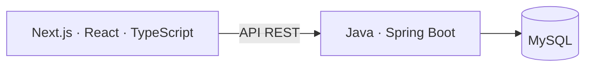

# TS Workspace

Sistema interno de gestão, operação e produtividade da **Tech Sisters**, comunidade
voltada para mulheres na tecnologia.

O TS Workspace reúne pessoas, equipes e rotinas da organização em um só lugar.
Seu objetivo é reduzir a dispersão de informações entre mensagens, planilhas,
documentos e calendários, com acesso controlado para fundadoras, diretoras,
supervisoras, suporte e voluntárias autorizadas.

## O que existe

- **Acesso por convite:** login, logout, sessões e bloqueio de usuárias inativas.
- **Usuárias:** gestão de perfil de acesso, status e participação em equipes.
- **Convites:** criação, cancelamento e aceite com validade e uso único.
- **Equipes:** hierarquia, integrantes, edição e arquivamento.
- **Início do Workspace:** perfil e equipes da usuária autenticada.
- **Autorização:** roles e permissões verificadas no servidor.

Tasks, Projetos, Eventos e os demais módulos de produtividade fazem parte do
roadmap. A [visão dos módulos](docs/product/modules.md) distingue o que está
implementado do que está planejado.

## Arquitetura e tecnologias

A arquitetura oficial separa apresentação, regras de negócio e persistência:



| Camada | Tecnologias |
| --- | --- |
| Frontend | Next.js, React, TypeScript, Tailwind CSS |
| API | Java 17, Spring Boot, Spring Security, Bean Validation |
| Persistência Java | Spring Data JPA, Hibernate, Flyway, MySQL |
| Sessões Java | Spring Session JDBC |
| Desenvolvimento e testes | Node.js, Maven Wrapper, Docker, Testcontainers, Vitest, ESLint |

A [arquitetura detalhada](docs/architecture/overview.md) explica as responsabilidades
e os contratos entre frontend e API.

## Repositório

```text
frontend/            Aplicação Next.js, clientes REST e testes
backend/             API Spring Boot, Maven Wrapper, migrations e testes
docker/              Configuração auxiliar do MySQL
compose.yaml         Serviços locais de banco de dados
docs/
  product/           Visão, módulos e roadmap
  architecture/      Contratos e decisões técnicas vigentes
  development/       Ambiente, testes e convenções
  history/           Registros históricos de engenharia
```

## Segurança

Autenticação e autorização são responsabilidades distintas. O acesso exige
sessão válida e perfil ativo; permissões são verificadas no servidor. Sessões
usam cookies HttpOnly, com proteção CSRF e origens CORS explícitas na API Java.
Credenciais, cookies e tokens não pertencem ao Git nem aos logs.

Leia [autenticação](docs/architecture/authentication.md) e
[RBAC](docs/architecture/rbac.md) para conhecer os contratos e limites.

## Executar localmente

Requisitos: **Node.js 24**, **Java 17** e **Docker com Engine Linux acessível**.
O Maven Wrapper acompanha o projeto; Maven global não é necessário.

Prepare os arquivos de ambiente e inicialize o banco/frontend conforme o
[guia de setup](docs/development/setup.md). Com essa configuração concluída,
execute a partir da raiz, em terminais separados:

```powershell
docker compose up -d mysql-java
powershell -NoProfile -File backend/run-dev.ps1
```

```powershell
cd frontend
npm ci
npm run dev
```

Abra [localhost:3000](http://localhost:3000).
A página [/infra](http://localhost:3000/infra) verifica a conexão com a API Java.
O acesso inicial depende do bootstrap administrativo descrito no setup.

## Testar

Backend, a partir da raiz, com Docker disponível:

```powershell
backend\mvnw.cmd -f backend/pom.xml -B test
backend\mvnw.cmd -f backend/pom.xml -B package
```

Frontend, dentro de `frontend/`:

```powershell
npm run typecheck
npm run lint
npm test
npm run build
```

Os testes de integração e HTTP usam bancos separados. Consulte
[como testar](docs/development/testing.md) antes de executá-los.

## Status

Projeto em desenvolvimento. Login, sessões, RBAC, equipes, usuárias e convites
são atendidos oficialmente pelo Spring Boot. O Next.js cuida da apresentação
e da navegação; MySQL persiste os dados e sessões.

## Roadmap

- Fundação Java, Auth, RBAC, Teams e Users/Invites concluídos.
- Próximo módulo: Tasks.
- Desenvolver produtividade: Tasks, Projetos, reuniões, arquivos e calendário.
- Ampliar a operação: conteúdo, eventos, parcerias e comunicação interna.
- Preparar produção: busca, auditoria completa, integrações e qualidade operacional.

Veja o [roadmap do produto](docs/product/roadmap.md).

## Documentação

- **Produto:** [visão geral](docs/product/overview.md) · [módulos](docs/product/modules.md) · [roadmap](docs/product/roadmap.md)
- **Arquitetura:** [visão geral](docs/architecture/overview.md) · [backend](docs/architecture/backend.md) · [frontend](docs/architecture/frontend.md) · [banco](docs/architecture/database.md) · [autenticação](docs/architecture/authentication.md) · [RBAC](docs/architecture/rbac.md)
- **Desenvolvimento:** [setup](docs/development/setup.md) · [testes](docs/development/testing.md) · [convenções](docs/development/conventions.md)
- **Histórico:** [registros de engenharia](docs/history/README.md)
