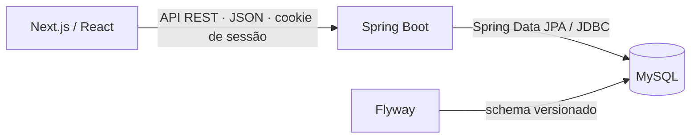

# Arquitetura do sistema

## Arquitetura alvo

O frontend apresenta dados e fluxos de interação. A API centraliza regras de
negócio, autenticação, autorização e transações. O MySQL persiste identidade,
sessões e dados de domínio. A organização é um monorepo com módulos por domínio.

## Responsabilidades

| Componente | Responsabilidade |
| --- | --- |
| Next.js | Rotas, renderização, formulários, estados de interface e consumo da API |
| Spring Boot | Contratos REST, validação, segurança e serviços de aplicação |
| JPA / Hibernate | Mapeamento e acesso aos dados de domínio |
| Spring Session JDBC | Persistência e invalidação de sessões Java |
| Flyway | Evolução versionada do schema Java |
| MySQL | Integridade relacional, persistência e transações |

## Funcionamento atual e migração

O frontend oficial usa Better Auth e serviços server-side Prisma para acesso,
RBAC, usuárias, convites e equipes. A API Java possui autenticação baseada em
sessão e health conectado ao banco; o cliente técnico em Next.js consome essa API.
O [RBAC Java](rbac.md) centraliza permissões e protege métodos da API.
A API de [Equipes Java](teams.md) oferece hierarquia, arquivamento e memberships
sem substituir ainda a página oficial `/equipes`.

Os bancos Java e Prisma são separados. Suas contas, sessões e migrations não
são intercambiáveis, e autenticar em um serviço não autentica automaticamente
no outro. A substituição ocorre por domínio, após validação funcional e de
segurança; a implementação anterior é preservada até a troca correspondente.

## Contratos

- A autenticação identifica a usuária; o RBAC decide o que ela pode fazer.
- O backend deriva a identidade da sessão, não de um userId escolhido pelo cliente.
- DTOs limitam o que a API expõe; entidades de persistência não são o contrato público.
- Mudanças de banco são migrations versionadas, sem geração automática de schema.
- UI condicional ajuda a navegação, mas não substitui autorização server-side.

Detalhes: [backend](backend.md), [frontend](frontend.md), [banco](database.md),
[autenticação](authentication.md), [RBAC](rbac.md) e [setup](../development/setup.md).
